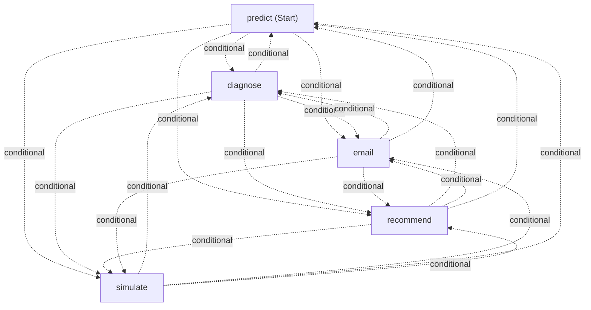
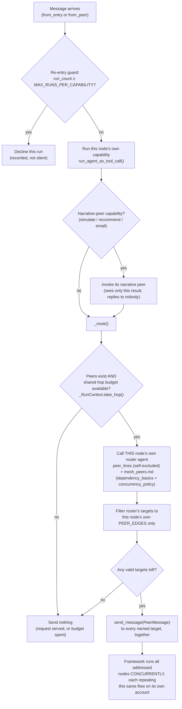

# Mesh B — condition manifest (concurrent peer-to-peer, no coordinator)

**Built 30-Aug-26 (T40).** `topologies/mesh.py`. Six live runs conducted 30-Aug-26 (below);
build/debug effort closed by the user the same day. One router-compliance finding
(`diagnose` re-addressing an already-addressed `simulate`, sixth live run) remains open as
a measured property, not a blocker — see that section for the n=1 caveat and what further
runs would need to show before treating it as systematic.

**Who decides scope and order:** each agent, locally. A node runs its own capability,
then decides for itself which peers should act next and *addresses* them. Nobody holds a
view of what the whole request still requires — that absence is the property under
measurement, not a gap to close.

**Nobody owns the request.** A node that is addressed acts on its own account and never
replies to whoever addressed it; there is no caller waiting and no turn afterwards in
which anyone checks up on it. This is what separates the condition from agent-as-tools,
which MAF's own documentation classifies as delegation — "the primary agent retains
overall responsibility for the task, while other agents are treated as tools." An earlier
version of this module was built that way and was wrong; see the module docstring in
`topologies/mesh.py` for the three faults it had.

**Concurrency:** structurally possible, and therefore MEASURED rather than compiled. A
node may address several independent peers at once, and the framework schedules them
concurrently — the same engine that gives Static-Graph DAG its ~1.0 exploited figure.
Whether a decentralised agent actually exploits it is the finding.

---

## Why this is not built on MAF's `HandoffBuilder`

MAF ships a Handoff orchestration and Microsoft describes it as "implemented using a
mesh topology where agents are connected directly without an orchestrator." That phrase
describes **connectivity** — who may pass to whom — not concurrent execution. Two facts
confirmed by reading the installed 1.11.0 source, not the docs:

1. Handoff passes **full task ownership**: the receiving agent takes over and the sender
   stops. Exactly one agent is ever active.
2. `HandoffBuilder._clone_chat_agent()` forces `allow_multiple_tool_calls=False` on every
   cloned participant — set *after* `deepcopy` of our own options, so it is not
   overridable. A participant cannot issue two tool calls in one turn at all.

That is a routing/delegation pattern, not peer collaboration. Building this condition on
it would have measured baton-passing while calling it a mesh. Hand-rolling instead
follows the same precedent already set twice in this codebase: Sequential rejected both
`SequentialBuilder` and `GroupChatBuilder` as not matching the condition, and
Static-Graph DAG is built on raw `WorkflowBuilder`.

The Handoff variant is **not discarded** — it is tracked as **Mesh A** in the tracker's
Topology Comparison sheet, as a candidate condition. Paired with this one it would
isolate concurrency as a single variable while holding roster, prompts and dependency
structure constant, which would be the cleanest controlled comparison in the study.

---

## Mechanism

### The peer graph

**Complete: every capability connected to every other, in both directions.** Regenerate
with `scripts/export_mesh_diagram.py` (`--peers` for the summary below, no flag for
Mermaid rendered from the real built `Workflow` via the framework's own `WorkflowViz`,
same discipline as Static-Graph DAG's diagram — so the figure cannot drift from what the
code executes).

```
nodes                 5  (diagnose, email, predict, recommend, simulate)
entry                 predict  (entry only -- not ownership)
directed edges        20   expected n(n-1) = 20
pairs connected       10/10
complete graph        True
all bidirectional     True
missing pairs         none
hop budget            10 shared across all peers, enforced in code
re-entry cap          2 runs per capability

peer edges (who each node MAY address; who it DOES is decided per run):
   diagnose   -> email, predict, recommend, simulate
   email      -> diagnose, predict, recommend, simulate
   predict    -> diagnose, email, recommend, simulate
   recommend  -> diagnose, email, predict, simulate
   simulate   -> diagnose, email, predict, recommend

narrative peers (not graph nodes -- invoked inside their own capability,
see only that capability's output, message nobody):
   email      -> email_summary
   recommend  -> recommend_summary
   simulate   -> simulate_summary
```



Both blocks above are verified output: the summary from `PEER_EDGES` directly, the
Mermaid from `WorkflowViz(_build_workflow(...)).to_mermaid()` against the real built
`Workflow` object (`uv run python scripts/export_mesh_diagram.py`, 30-Aug-26) — so it
cannot drift from what the code executes. Each `-.conditional.->` edge is the framework's
own label for a conditional edge, matching the caveat in the next paragraph: the diagram
is 20 directed edges, not 10 undirected pairs, because that is how `WorkflowViz` reports
`WorkflowBuilder`'s underlying directed graph even though `PEER_EDGES` is symmetric.

**What the diagram does not show.** Two things, both deliberate, not omissions to fix:

1. Only 5 nodes appear — the domain capabilities. The 3 narrative peers
   (`simulate_summary`, `recommend_summary`, `email_summary`) are **not** executors in
   this `WorkflowBuilder` graph and never will be: they are invoked from inside their own
   capability's `_act()` via a plain function call (`run_agent_as_tool_call`), see only
   that one capability's already-produced result, are not in `PEER_EDGES`, cannot be
   addressed by any node, and never address anyone themselves. Confirmed by reading
   `PeerNode.__init__`/`_act()` — `nodes = {c: PeerNode(c, agents, run) for c in
   PEER_EDGES}` never includes them. Putting them in this diagram would misstate them as
   participants in the peer-messaging graph, which is exactly the thing they are not.
2. Every edge carries a condition testing whether its target was named by the sending
   node's routing decision. The graph shows which peers *can* address each other; which
   ones actually do is decided per run, per node, and is the thing under measurement. A
   fully-connected picture is the starting point, not observed behaviour — read a run's
   `sender -> receiver` trace lines for what happened.

**Why complete rather than derived from `TRUE_DEPENDENCIES` (changed 30-Aug-26).** An
earlier version built these edges from the dependency table, which connected only the 5
pairs with a hard data prerequisite between them — the DAG's own skeleton with reverse
edges. It left `diagnose↔simulate`, `diagnose↔email`, `recommend↔email`,
`email↔simulate` and `recommend↔simulate` with **no channel at all**. Those are not data
dependencies, but they are exactly the lateral flows a mesh exists to enable: diagnose
telling simulate which patterns are worth exploring, recommend informing what the
customer emails should say.

That mattered because it made *"does decentralised routing find useful lateral paths?"*
unanswerable **by construction** — Mesh could never route anything the DAG could not, so
any "Mesh behaves like the DAG" finding would have been partly built in. It is the same
error this project already refused one layer down, where Static-Graph Routed deliberately
does not close the router's selection under `TRUE_DEPENDENCIES` because that "would erase
the very thing under measurement." Deriving the *communication graph* from that table does
the identical thing.

The complete graph matches the literature's definition (a mesh is the complete graph, up
to n(n−1) edges) and sits under the 6–8 agent ceiling it cites before Echo Chamber and
O(n²) coordination cost dominate.

**`TRUE_DEPENDENCIES` is not imported by `mesh.py` at all.** It still governs what each
capability consumes — stated to every agent through the capability list — and is what
`check_dependencies()` judges runs against. So a peer addressed before its inputs exist
surfaces as an ordinary dependency violation, the finding, rather than being prevented by
a missing edge.

**Methodology caveat, to state rather than hide:** against Static-Graph DAG this now
varies **two** things — graph shape *and* decision mechanism — not one. Mesh A (Handoff:
same roster, sole ownership) and Static-Graph Routed are the intermediate controls that
sit between them. An earlier draft of this file claimed the sparse graph gave a "clean
controlled comparison"; that was over-sold, since holding the graph identical bought
internal validity by removing the condition's defining capability.

The graph is **cyclic**, which is faithful to a mesh and has two consequences handled in
code: the shared hop budget is enforced in code (with no coordinator, nothing else can
stop a message loop), and a per-capability re-entry cap stops a cycle thrashing while
still recording duplicate work, which is an expected mesh cost rather than an error.

**Hop budget:** the shared 10-call limit, combined across all peers rather than per
agent, matching what `self_check.md` states in prose to every agent. A refused call
returns a readable error to its caller rather than raising, so the caller can report it
the way it would report any other tool failure.

**The contrast with Static-Graph DAG.** DAG reaches diagnose/simulate/email because
*code compiles that edge*. Mesh reaches them only if *predict decides to address them*,
on the same execution engine — compiled edges versus agent-decided messaging.

Note the comparison is no longer "identical structure, one variable" — an earlier draft
of this file claimed that, and it stopped being true when the graph went complete
(see the methodology caveat above). Mesh now has strictly **more** available edges than
the DAG, which is deliberate: it means "Mesh used only the dependency edges anyway" and
"Mesh found a useful lateral path" are *both* observable outcomes. Under the old sparse
graph, only the first was possible.

**A prerequisite skipped is a finding, not a bug this code fixes.** With a complete
graph, any node can address any other — including predict addressing recommend before
diagnose has run. `mesh_peers.md` tells agents not to name a peer whose inputs are not
ready, and the capability list states what each one consumes; if a node does it anyway,
it surfaces as an ordinary dependency violation in `check_dependencies()` — the same
mechanism and the same finding-not-defect classification already applied to
Dynamic-Graph (R42.1) and Static-Graph Routed. Closing the graph under the dependency
table to prevent it would erase the thing being measured.

### Runtime logic per node

The peer graph above is the static shape — every edge that *could* fire. This is what
actually runs inside `PeerNode._act()`/`_route()` every time a node is entered, whether
from `from_entry` (the workflow's start executor) or `from_peer` (an addressed message):



Two things this makes visible that the static peer graph can't: routing is a **second,
separate LLM call** per node (the router), not a decision the capability's own agent
makes as part of producing its result — and "concurrent" means several branches of *this
same diagram* running at once, one per addressed peer, each with its own re-entry guard
and its own routing decision, none aware of the others.

**How a run ends.** There is no terminal node in the diagram above — every branch just
stops (declined re-entry, empty routing decision, or budget exhausted). When every branch
has stopped, the workflow goes idle and `MeshEntryPoint._assemble()` builds `MasterOutput`
in **code**, in the caller's turn, from `run.results` — a step no agent ever sees or
participates in (see "The three narrative peers" below for why this doesn't reopen R17).

---

## The three narrative peers

`predict` and `diagnose` narrate themselves inside their own schemas. `SimulationsList`,
`RecommendedActionsList` and `EmailsList` carry no free-text field, so those three
narratives exist in other conditions only because a coordinator had somewhere to put
them. Mesh has no coordinator, so each becomes a single-purpose **peer**:
`simulate_summary`, `recommend_summary`, `email_summary` (tools-off, one field each).

**This does not reopen R17.** R17 rejected a *covering aggregator* because one LLM
seeing every capability's output rebuilds a hub. No narrative peer sees more than one
capability's output, so none of them is a hub. The final `MasterOutput` is assembled in
**code** from results peers already returned to their callers — the same serialisation
`write_run()` performs for every condition, and no agent gains a global view.

Each peer's output-schema description is read programmatically from
`MasterOutput.model_fields`, so Mesh's narrative guidance is byte-identical to what every
other condition receives through `response_format` — the equalization control enforced
structurally rather than by copying text that would then drift.

**Consequence to state in the methodology:** 8 agents here against 5 + a coordinator
elsewhere, which changes the n(n−1) connection maths and the cost profile.

**Why the narrative peers don't carry `security_guardrails` (not a gap — checked against
this codebase's own precedent).** Every narrative peer receives another capability's
already-produced structured result, never the user's raw text — the same shape as
`aggregator.md` in Static-Graph DAG, Static-Graph Routed and Dynamic-Graph, all three of
which also omit `security_guardrails`/`chatbot_behavior`/`scope_selection` (compare their
`.md` files: `@self_check`, `@exception_handling`, `@output_contract`, nothing upstream of
that). Guardrail screening belongs at the point where raw user text first enters the
system — here, `entry_point.md`, on predict — not re-run at every downstream write-up
step. Re-screening structured, already-validated intermediate output would be dead prompt
tokens against nothing, not extra safety.

**Why the narrative peers don't carry the full `output_contract.md`.** That file states
"your structured output has only: `chat_response`, `simulate_summary`,
`recommendation_summary`, `email_alert_summary`" — true for anything filling the whole
`MasterOutput` (every `aggregator.md`, every `master.md`/`coordinator.md`), false here.
Each narrative peer's actual schema, built by `_narrative_schema()`, has exactly **one**
field, always named `summary`. Including the full file would tell the model its output
has four named fields it cannot fill and say nothing about the one it must — a
prompt/schema mismatch in the same family `check_prompt_schema_agreement()` polices
elsewhere. `@narrative_field_guidance` (the field-content rules — the total-vs-sample-count
trap, the fabrication ban, what belongs in which narrative) is the reusable part and is
what each peer actually carries; which field a given peer is writing comes from its own
schema description (`MasterOutput.model_fields[...].description`, read at construction),
not from the 4-field enumeration. This is also why `output_contract` was never in
`CORE_SHARED` in `validate_specs.py` to begin with — it was always scoped to
MasterOutput-filling agents, not universal.

---

## Files in this folder

- `entry_point.md` — where the request enters. Gated by `validate_specs.py` per
  `registry.py`'s `coordinator_key`. Carries `security_guardrails`,
  `chatbot_behavior`, `input_handling`, `scope_selection`. It does **not** carry
  `mesh_peers.md` and never has — predict's own agent turn never decides routing (see
  next paragraph), so putting peer-addressing guidance on its prompt would not reach the
  thing that actually needs it.
- `simulate_summary.md`, `recommend_summary.md`, `email_summary.md` — the narrative
  peers. Each carries `shared/narrative_field_guidance.md` (fixed 30-Aug-26 — these three
  files used to reinvent a shorter, generic version of the same rules instead of the real
  one, which meant Mesh's narratives were being written to a different, weaker rulebook
  than every other condition's on the identical output fields; see the module docstring's
  correctness-pass note in `_narrative_schema()`'s neighbourhood in `mesh.py`).

**Where the routing guidance actually lives (fixed 30-Aug-26).** Neither `entry_point.md`
nor any of the 8 agent `.md` files above carries `mesh_peers.md` — an earlier version of
this file and of `validate_specs.py`'s exemption comments claimed all eight carried it,
which was never true after the WorkflowBuilder rebuild. Routing is decided by 5 small
tools-off agents, one per capability, built in Python by
`topologies/mesh.py::_build_router()` — not sourced from `entry_point.md` or any of the
other files this folder's own gate reads (`validate_specs.py` only walks that one file's
`@include` tree per condition). Each router's instructions are: that node's own peer list
(name + what it consumes/produces, self excluded), followed by
`get_instruction('mesh_peers', topology='mesh')`, which loads `mesh_peers.md` — a real file
**in this folder** (moved out of `shared/` 30-Aug-26; see next paragraph). That file
directly includes `@dependency_basics` and `@concurrency_policy` (also fixed 30-Aug-26 —
an earlier version paraphrased them in Mesh's own words instead of including the real
files, which is the duplication this codebase's own convention rules out) — the identical
shared text every other order-deciding prompt gets, wrapped in the addressing-specific
rules that have no shared-partial equivalent (no reply, no repeat-work, hop budget,
malformed-result handling). See `validate_specs.py`'s `EXEMPT` reasons for
`("mesh", "dependency_basics")` etc., which name the mechanism precisely.

**Where each router's own peer list (the `name + what it consumes/produces` part above)
actually comes from.** Not an `@include` at all — a direct Python dict lookup, the only
path by which `shared/capability_details.md` reaches Mesh. Chain: the file is parsed once
at import by `core/tool_descriptions.py::parse_capability_details()` into the module-level
`CAPABILITY_DESCRIPTIONS` dict → `topologies/mesh.py` imports that dict → `_build_router()`
does `peer_lines = "\n".join(f"- {p} -- {CAPABILITY_DESCRIPTIONS[p]}" for p in peers)`.
Nothing else in Mesh reaches this file: not `entry_point.md`'s include tree, not any of
the 5 domain agents' own prompts (checked directly — no `@@capabilities:` or
`@capability_details` in any of them). Only the 5 routers see it, because only they decide
who to address next. It bypasses the `@@capabilities:<name>` directive every
`CAPABILITY_VARIANTS` file (`tool_capabilities.md` etc.) uses, because those render an
unfiltered all-5 list at load time and the router needs a *self-excluding* list that
differs per node — no static `.md` render can produce that under a complete graph, where
"my peers" is always "everyone but me."

**Why `mesh_peers.md` and `mesh_handoff.md` live here and not in `shared/` (fixed
30-Aug-26).** Both used to sit in `shared/`, findable only by the `mesh_` filename prefix.
`shared/README.md` already has a house rule against exactly this, established the hard way
twice: `result_expectations.md` and `deliverable_contract.md` were both put in `shared/`
early on, both ended up silently included by conditions that had no business reading
Swarm-only content, and both were corrected by moving them into the one topology's own
folder (Risk Log R19, R22). `mesh_peers.md`/`mesh_handoff.md` were the same category of
mistake, just never caught because nothing else's `@include` happened to collide with the
name — informal safety, the same kind R18/R19 already burned this project on once. Moved
here for consistency with the project's own stated rule, not because anything was
observed to break.

`shared/peer_tool_capabilities.md` (peers listed by **callable name**, unlike
`shared/peer_capabilities.md`, which deliberately omits names because Mesh A addresses
peers by role rather than calling them) correctly stays in `shared/` — it is one of the 5
interchangeable `CAPABILITY_VARIANTS` roster renders (`tool_capabilities.md`,
`raw_tool_capabilities.md`, `participant_capabilities.md`, `peer_capabilities.md`,
`peer_tool_capabilities.md`), which live together in `shared/` as a family regardless of
which single condition's style each one happens to match, since they share one rendering
mechanism (`core/tool_descriptions.py::render_flat()`) and one schema-agreement check. It
is **not currently included by anything** — the router builds its own per-node,
self-excluding version of the same list instead, since this variant's render is unfiltered
(all 5, including self) and the router needs one capability excluded per node. Left on
disk because `core/tool_descriptions.py`'s schema-agreement check still verifies it
renders correctly against the wiring; its tagline was corrected 30-Aug-26 to drop language
from the discarded agent-as-tools design ("...return their result to you").

**Entry framing rides on predict's own prompt.** Since predict is the fixed entry point,
the security/scope framing every other condition gets in a turn-1 coordinator call is
prepended to predict's system prompt via `build_predict_agent(instructions_prefix=...)`,
at construction. Prepended, never substituted — the shared domain prompt underneath stays
byte-identical to the version every other condition uses.

---

## Capture

Agents are built with `middleware=None`, as in Planner-Executor, and peer invocations are
recorded through `run_agent_as_tool_call()`. That yields exactly **one** canonically-named
`tool_call` row per peer call, directly comparable with every other condition. Attaching
middleware at construction instead would have additionally captured each agent's own raw
MCP calls and roughly doubled Mesh's row count for identical work.

**Prerequisite fixed before this condition was written:** per-tool token attribution used
to pair usage to tool calls by *(name, completion order)*, which two concurrent calls of
the same tool would silently swap. Mesh B is the first condition able to trigger that,
and duplicate peer invocation is an *expected* mesh cost it must measure accurately. Now
correlated by `call_id` — Risk Log R50 / T114, `CAPTURE_VERSION` 2.

---

## First live run (30-Aug-26) — two bugs found, both fixed, not yet re-run

**n = 1. This section reports what one run showed and what was changed because of it, not
a result.** The run itself crashed before writing to the run store, so nothing from it is
in measurement data — everything below comes from the console trace only.

**1. Crash: `response.value = self._assemble(run.results)` — `AttributeError: property
'value' of 'AgentResponse' object has no setter`.** Confirmed against the installed
1.11.0 source (`agent_framework/_types.py`): `value` is a read-only `@property` backed by
`_value`/`_value_parsed`, set only through the constructor's `value=` kwarg — no code
path anywhere in the framework exposes a setter. Fixed by setting the backing fields
directly (`response._value = ...; response._value_parsed = True`), which is exactly what
`__init__` does internally with its own `value=` argument. No other topology hit this,
and a repo-wide check confirms Mesh is the only one that ever tries to substitute a
different value onto an already-built `AgentResponse` — every other condition's final
schema is produced naturally by the last agent call in its own chain.

**2. Routing gap: `recommend` was never named once, across 8 completed routing decisions,
despite the query explicitly asking for recommendations and both of `recommend`'s
prerequisites (`predict`, `diagnose`) finishing by hop 1.** Confirmed from the trace, not
inferred — no `-> recommend` line appears anywhere in the run. In the same run,
`predict`/`diagnose`/`email` were each repeatedly re-addressed after already completing,
burning 8 of the 10 shared hops on re-runs rather than reaching every capability the
request needed.

Root cause, traced to a real prompt gap rather than a model failure: a router was told
its OWN capability had just finished (`"You have just completed the {capability} step"`)
and was shown its peers' static consumes/produces facts, but was never told which OTHER
capabilities had already produced a result anywhere else in the mesh. Naming `recommend`
correctly required inferring "predict must be done, because my own capability needed
predict's output to run" — a fact never stated, since a router never sees its own
capability's description (only its peers'). And "don't re-address a finished peer" (stated
explicitly in `mesh_peers.md`) was unenforceable, because nothing had ever told the router
what was finished; the file's own text even said so — `"nobody is tracking what has
run"` — as a plain fact, not a policy this design had committed to.

Fixed in `PeerNode._route()`: the router's per-call message now states, as fact, which
capabilities have already produced a result in this run (`run.results`, filtered to real
capability keys) — the router's own account included. This doesn't reintroduce a
coordinator: nothing aggregates it, nothing checks the request is fully served, no node's
own routing decision is influenced by anyone else's — it only gives each decision an
honest, current status readout, the same thing a real peer node could plausibly see if it
could read a shared execution log. `mesh_peers.md` and the routing schema's field
description were both corrected to stop claiming "nobody is tracking what has run," since
that stopped being true.

## Second live run (30-Aug-26) — prediction partly confirmed, one more gap found and fixed

**Still n = 1 per run.** The crash fix worked: the run completed, persisted
(`run_id=11400b64...`), and was scored. Fix 2's prediction was **partly right**:
`recommend` WAS named this time — twice (`diagnose -> recommend`, `simulate -> recommend`)
— confirming the "tell the router which capabilities have finished" mechanism does surface
capabilities it previously missed entirely. But re-addressing an already-completed
capability did **not** drop toward zero as predicted: `diagnose`, `simulate`, `predict`,
and now `recommend` itself each ran twice, spending 8 of 10 hops again, and the run's own
`RUN VALIDITY` output flagged 3 empty results and only 79% of achievable overlap
exploited. The prediction being wrong is itself the useful part — it pointed at what the
first fix actually missed rather than what it was assumed to fix.

**Root cause of the miss, read from this run's own timeline (`RUN VALIDITY`), not
guessed:** predict fanned out to `diagnose`/`email`/`simulate` at once (~40s in). `email`
finished fast (~8s of real work) while `diagnose` and `simulate` were still running
(30-40s each). Fix 1 only told a router which capabilities had **finished**
(`run.results`) — at the moment `email`'s router ran, `diagnose` and `simulate` were
absent from that list (correctly — they genuinely hadn't finished), so `email`'s router,
reasoning correctly from incomplete information, redundantly re-addressed both. The same
race produced `recommend` running twice: `diagnose` addressed it, then `simulate`'s
router — running concurrently, unaware — addressed it again before it had finished.

**Fixed by splitting "addressed" from "finished."** `run.run_counts[cap]` is stamped the
instant a node *begins* (`PeerNode._act()`), before its capability call even completes —
available far earlier than `run.results`. `_route()` now tells the router two lists:
everything already **addressed** (running or done — never re-address these) and, within
that, whichever have actually **finished** with output to work from (only these satisfy a
peer's stated input requirement). `mesh_peers.md` and the routing schema's field
description were both rewritten to carry this distinction rather than a single list.

**3. `recommend` ran twice and returned an empty actions list both times — not a routing
bug at all, a missing hand-off.** Flagged directly from this run's own scoring output:
`recommendation_summary = "No recommendation summary available because no recommended
actions were returned"`, `recommendation_tool` output 26 characters both times, and the
capability blend scored `rel=0.40 faith=1.50 safe=1.50` — the run's worst result by a wide
margin. `recommend`'s own domain prompt (`agents/recommendation.md`) explains exactly why:
`recommend_actions()` takes `diagnosis_summary` as a REQUIRED argument, and the prompt
tells the agent to "pass through the diagnosis text you were given in your task" — but
`PeerNode._act()` invoked every node, `recommend` included, with only the raw user query,
never another capability's actual output. `recommend`'s own Missing-Input Handling
correctly returned an empty list rather than fabricate — the model followed its
instructions exactly; the instructions were given nothing to follow them with.

`static_graph_dag.py` already solved this identical problem: `_recommend_task()`, with
the comment "the hand-off is made in code... because no model is constructing the
arguments," and its own note that `recommend` is the *only* capability needing this
(every other tool self-serves from the prediction DB/CSV predict wrote to disk). Mesh
mirrors it directly — `_task_for()` builds `recommend`'s task from `query` plus
`results["diagnose"].value.diagnosis_summary` — rather than reinventing a second
mechanism for the same fact.

**4. Turn 2's wasted graph re-run, addressed in `entry_point.md`.** `execute_topology.py`
sends the same scripted "Yes, proceed." to every condition uniformly — `plan_presented`
is itself a measured comparison field, so this is not something to skip for Mesh alone.
`static_graph_dag`/`static_graph_routed`/`dynamic_graph` absorb it cheaply because each
has a tools-off triage call ahead of the expensive work; Mesh has no coordinator anywhere
to put a gate on. Rather than add one (which would blur the property this condition
exists to measure), `entry_point.md` now tells `predict` — who is both entry and first
worker in the same turn here — to recognize a bare confirmation with no new order data,
scenario, or capability request as nothing to act on, and decline the way it already does
for a missing file path: empty `delayed_orders`, a plain statement in `predict_summary`,
no tool call. Companion fix in `_assemble()`: `chat_response` was previously hardcoded
empty regardless of what predict said, so a correct decline was still invisible to the
user; it now surfaces `predict_summary` whenever `delayed_orders` is empty, leaving the
real-data path (`chat_response=""`) unchanged for actual runs.

## Third live run (30-Aug-26) — predictions 1-3 confirmed; turn 2 still re-ran the graph

Fixes 1-3 (crash, addressed/finished split, `recommend`'s diagnosis hand-off) all
confirmed as predicted: `recommend` produced real, non-empty recommendations both times
it ran (`recommendation` blend score `3.90/5`, up from `0.40/5`); the run completed and
scored `4.42/5` overall. Fix 4 (`entry_point.md`) also worked exactly as designed and is
directly visible in the transcript: turn 2's `predict` declined without calling its tool
(2.98s vs a real ~40s run) and `chat_response` correctly read "This message had nothing
actionable... because no input orders file path was provided."

**But the graph still ran a second time in full.** `predict` declining stopped *predict's
own* tool call, but `predict`'s ROUTER is a separate agent call and still ran — and it
still addressed `diagnose`/`email`/`simulate` (which then addressed `recommend`), because
the router's only signal was "did predict run" (yes, technically) rather than "did predict
produce anything to build on" (no). No amount of rewording `mesh_peers.md` closes this
cleanly: "ran" and "produced something real" are genuinely different facts, and giving the
router the second one for every peer, on every call, starts to look like reconstructing a
coordinator's global view one field at a time — precisely what this condition exists not
to have.

**Fixed structurally instead, mirroring `sequential.py`'s own solution to the identical
harness problem.** `sequential.py` holds `self._plan`/`self._query` across its two `run()`
calls on one instance (`execute_topology.py` builds `master` once and calls `.run()` on it
twice — confirmed by reading `execute_topology.py`, not assumed) and its own `run()`
explicitly ignores turn 2's "Yes, proceed." text, using turn-1 state instead. Mesh's
`MeshEntryPoint` now does the equivalent for its own shape: turn 1 already **is** full
execution, so there is nothing for turn 2 to separate out and execute — `self._done` and
`self._final_response` are set at the end of a real run, and `run()` returns the stored
response immediately on any later call, before building a single agent or entering the
graph. No router runs, no capability re-fires, no tokens spent on turn 2 at all. The
`entry_point.md`/`_assemble()` fixes stay in place — not redundant, since they still cover
a genuinely non-actionable FIRST message outside this specific harness's turn-2 pattern —
but they are no longer what turn 2 relies on.

**Still to do, in order:**

- Re-run with all five fixes in place. Predicted: turn 2 shows zero tool calls and zero
  agent calls, `chat_response` on turn 2 is identical to turn 1's structured content
  (byte-for-byte, since it is the same stored object), and total run cost drops by
  roughly turn 1's own cost (turn 2 currently duplicates almost all of it). Any of these
  being wrong is itself the finding to report, not a reason to stack a sixth patch on
  five unconfirmed ones.
- Watch whether `entry_point.md`'s decline paragraph ever fires on a genuine turn-1
  action request by mistake, now that it is no longer load-bearing for turn 2.
- Verify concurrency actually appears in `started_offset_s`/`ended_offset_s` rather than
  assuming the fan-out is taken (partially confirmed this run: 79% of achievable overlap
  exploited, 13 pairs left sequential — worth a closer look once the addressed/finished
  fix reduces how much of the trace is redundant re-runs).
- Check the `unprompted` rate: with no coordinator, an agent calling peers the query never
  implied is a real finding about decentralisation, not a prompt bug to patch away.
- Watch for duplicate invocation of the same capability that survives the fix above —
  expected in smaller amounts, and the point; the question is whether it is still
  excessive.

## Fourth live run (30-Aug-26) — over-calling: the router never had scope, only readiness

A query needing only `predict`/`diagnose`/`email` ("...can you notify the affected
customers?" — no mention of what-if scenarios or optimization) still ran `simulate` and
`recommend` anyway. Confirmed structurally, not just from this one trace: grepping
`topologies/mesh.py` for `scope_selection` before this fix returned nothing. Every domain
agent DOES receive the original query verbatim on every hop — confirmed from the same
run's own `input=317 chars` appearing identically on predict's, diagnose's and email's
tool-call rows, matching `_task_for()`'s design (query passes through unchanged for every
capability except recommend). The gap was never "does the agent see the query" — it was
"does the router, which decides who else runs, ever check the query against scope."

`entry_point.md` already carries `@scope_selection`, and always has — but that governs
only `predict`'s own decision to act on turn 1. The actual "who else needs to run"
decision belongs to each node's router, the direct structural equivalent of every other
topology's coordinator (the thing that reasons about scope everywhere else in this
study) — and it had only ever been given `dependency_basics`/`concurrency_policy`
(readiness: whose inputs exist) with nothing telling it to check the request against
scope at all. Readiness without scope defaults to routing the full graph: every peer
whose inputs happen to be ready gets addressed, regardless of whether the query asked
for it, because nothing in the router's instructions ever raised the question.

Fixed by adding `@scope_selection` directly to the router's instructions (same file, same
text, every other order-deciding agent in the study reads), plus one added sentence
telling the router explicitly to apply it to the request text it already receives with
every call (`_route()`'s own message already carries `self._run.query` in full — this
fix needed no new plumbing, only the missing instruction). This is also why the fix
belongs on the router and not on `mesh_peers.md`: scope and dependency-readiness are
different questions (what the query needs vs. what is ready to run), and conflating them
inside a file already carrying five other concerns would have been the same kind of
duplication this project has already corrected twice (`shared/README.md`'s R19/R22).

**Still to do, in order (all four still pending; this is now a fifth open item, not yet
re-run):**

- Re-run and confirm: for a query naming only a subset of capabilities, only that subset
  (plus whatever they structurally need, e.g. `recommend` pulling in `diagnose`) should
  run. If scope reasoning conflicts with a genuine dependency need, that conflict — and
  how the router resolves it — is itself worth reading closely on the next run, not
  assumed away.
- Everything listed under the third live run above, unchanged and still unconfirmed.

---

## Fifth live run (30-Aug-26) — scope-selection confirmed; one measurement-layer defect
found and fixed (not a Mesh finding)

The re-run confirmed the fourth fix: over-calling stopped. User confirmed the run itself
was fine. Two lines in the generated report were flagged as wrong:

```
email_summary_tool could have run alongside predict_delivery_delays_tool (ready at
0.00s, actually started 49.30s)
email_summary_tool could have run alongside email_alert_tool (ready at 0.00s, actually
started 49.30s)
```

This is not a Mesh orchestration finding — it is a bug in `measurement/dependencies.py`,
the shared scoring module every topology's report is built from. Root cause: Mesh's three
narrative-peer calls (`simulate_summary_tool`, `recommend_summary_tool`,
`email_summary_tool` — see `NARRATIVE_PEERS` and `PeerNode._act()` in `topologies/mesh.py`)
are instrumented through `run_agent_as_tool_call()` exactly like the five real
capabilities, so they land in the same `tool_call` rows the report reads. But
`TRUE_DEPENDENCIES` never had entries for them, and every function in `dependencies.py`
falls back to `.get(name, ())` for an unmapped name — reading a narrative call as a
zero-prerequisite node, "ready" at t=0 and independent of everything. In reality
`email_summary` consumes `email_alert_tool`'s own output and runs synchronously right
after it inside `_act()`; it could never have started earlier, let alone alongside
`predict`.

No other topology has this problem because none of them capture their narrative-writing
step as a separate `tool_call` row at all — it is one field on the closing/aggregator
turn's own structured output (confirmed by reading `static_graph_dag.py`'s
`AggregatorNode.summarise()`, `static_graph_routed.py`, and `sequential.py`'s closing
turn). So the fix is not to give the narrative calls correct `TRUE_DEPENDENCIES` edges —
that would make Mesh's narrative-writing cost visible to a comparison no other condition
pays into — it is to make them invisible to this analysis the same way every other
topology's narrative-writing turn already is. Added `_capability_calls()` to
`measurement/dependencies.py`, filtering to the five canonical capabilities before
`check_dependencies()`, `missed_concurrency()`, `critical_path_s()`, and
`concurrency_report()` see the rows — so a narrative call can never again be reported as
"ready" or "independent," and `actual_span_s`/`fully_serial_s` are no longer inflated by
it either. Verified with a synthetic call list reproducing the exact reported case: before
the fix, both flagged lines (plus two more of the same kind) appeared; after, they are
gone and the one genuine, correctly-computed finding remains (`email_alert_tool` really
could have overlapped `diagnose_delay_patterns_tool` — both real, both independent per
`TRUE_DEPENDENCIES`).

**Classification: build defect, not a finding** — per this project's own rule, a
cross-condition difference is only a finding if it reflects orchestration behaviour;
this was the scoring code itself misreading its own instrumentation, so it is fixed and
logged as a defect, not reported as something Mesh did wrong.

**Still to do:** re-run once more to confirm the corrected report against a fresh trace,
and carry forward everything still open from the third/fourth live run sections above.

---

## Sixth live run (30-Aug-26, `Q5`) — `diagnose` re-addressed an already-running `simulate`:
a router-compliance finding, not a defect

`predict` finished at 39.80s and addressed `diagnose` and `simulate` together in one hop
(both started ~41.30s, ran concurrently — correct). `diagnose` finished at 67.74s, and its
own router named `simulate` again, triggering a second `simulate` run (hop 3, `run 2`) —
26.36s and a further ~85k tokens for a result 15,977 chars long against the first run's
16,574, i.e. substantively the same output twice.

**Ruled out as a data-race in `_capability_calls()`'s pipeline or the addressed/finished
split fixed earlier this session:** `run.run_counts[cap] = ran + 1` in `_act()` is written
synchronously, with no `await` between the re-entry guard's check and the write — asyncio
here is single-threaded and cooperative, so there is no window in which a concurrent
routing call can observe a stale value. `simulate`'s `run_counts` entry was written at
41.30s; `diagnose`'s own router cannot fire before diagnose's capability call ends at
67.74s. So the `addressed` line diagnose's router received was correctly
`diagnose, predict, simulate` — `simulate` was already on it, by a margin of over 25
seconds, not a near-miss. `mesh_peers.md` — the same file, unchanged since the second live
run's fix — is unambiguous: *"Do not name a peer that has already been addressed... this
covers ones still running... Naming one that is already on it is... the most expensive
mistake available to you here."* The router named it anyway, holding accurate information
that told it not to.

**Classification: finding, not defect** — the addressed/finished data pipeline (fixed
twice earlier this session) worked correctly here; the model had the right facts and did
not follow them. That is decentralised routing under this condition's own design, exactly
what this study measures, not a bug to close.

**A related but separate gap, found while checking this — logged, not yet acted on:** the
module docstring frames lateral re-addressing as sometimes legitimate ("diagnose telling
simulate which patterns are worth exploring"), but `_task_for()` only special-cases
`recommend`'s hand-off — every other peer, `simulate` included, receives the identical
plain `query` text on every run. So even a well-intentioned re-address currently carries no
new information; a second run is structurally guaranteed to be near-duplicate work, not an
informed one. The architecture's own stated justification for allowing re-addresses is not
actually wired up.

**Decision (user, 30-Aug-26):** given three options — (a) leave the prompt-only
prohibition as-is and keep logging occurrences as findings; (b) add a code-level filter in
`_route()` stripping already-addressed targets before sending, making non-duplication
structurally guaranteed; (c) fix `_task_for()` so a re-address actually carries new
information — the user chose **(a)**. Rationale stated: this keeps "does decentralised
routing avoid wasted work" a genuine measured property, consistent with how
`MAX_RUNS_PER_CAPABILITY` is already framed in the module docstring — a thrashing
backstop, not a correctness guarantee. Options (b) and (c) remain open if the pattern
proves systematic rather than a one-off.

**N and what it would take to say more:** n=1 for this specific failure (`diagnose` →
`simulate` re-address). Cannot yet say whether this is systematic or a one-off; needs
repetition across multiple queries/runs before treating the rate as a property of the
condition rather than a single observation.

---

## Build/debug effort closed (30-Aug-26, user)

All five structural fixes from live runs one through five are confirmed working in
combination (this sixth run's own trace: correct scope-limited routing, no crash, no
turn-2 re-run, `recommend` receiving `diagnose`'s real summary, no measurement-layer
false positives). The "Still to do" lists under the third, fourth, and fifth live run
sections above are superseded by this run and by the fifth live run's own re-run — closing
them out rather than editing them, to keep the run-by-run history exactly as observed
rather than overwritten.

What remains open is not a blocker on this condition, only future work if pursued:
- The sixth live run's router-compliance finding (`diagnose` re-addressing `simulate`) —
  n=1, logged as a measured property per the user's decision above, not fixed.
- The related `_task_for()` gap (re-addresses currently carry no new information) —
  logged, not acted on.
- Repetition across more queries, to see whether the compliance finding recurs at a rate
  worth reporting, or was a one-off.

---

## Finding (Aditi, 30-Aug-26) — dense peer-to-peer communication needs explicit
constraints on routing and termination

> Dense peer-to-peer communication can create redundant message propagation, repeated
> agent activation, and potentially cyclic execution unless message routing and
> termination are explicitly constrained.
>
> We implemented Full Mesh with minimal routing constraints and termination condition
> that limit number of runs.

```
MORE DYNAMIC / DECENTRALIZED
        ↓
Full Mesh
  Every agent can communicate with every other agent
  Runtime determines who talks next
  Minimal routing constraints
        ↓
Constrained Mesh
  Agents still have peer autonomy
  But only certain peer relationships are allowed
        ↓
Partial Mesh / Dependency Graph
  Only predefined relationships are permitted
  Runtime may choose among permitted paths
        ↓
Static Graph with Conditional Routing
  Graph/edges are predefined
  Runtime chooses which predefined edge to activate
        ↓
Static DAG
  Edges AND execution order/dependencies are predetermined
        ↓
Sequential Chain
  One predetermined path
        ↓
MORE STATIC / CENTRALIZED
```

**Grounding — this is not a general claim taken on faith, it is what the six/seven live
runs above actually produced**, on the complete-graph, minimally-constrained end of this
spectrum (Mesh B = Full Mesh, per the diagram's own top tier — every agent can address
every other, `PEER_EDGES` is the complete n(n-1) graph, not derived from
`TRUE_DEPENDENCIES`):
- **Redundant message propagation / repeated agent activation** — sixth live run
  (`diagnose` re-addressed an already-addressed `simulate`) and seventh live run
  (`diagnose` and `simulate`, in the same Pregel superstep, both independently addressed
  `recommend`). Two different mechanisms — a router-compliance miss and a structural
  scheduling race — but both are instances of exactly this: dense P2P without a
  coordinator produces duplicate work that a graph with predefined edges/order cannot.
- **Potentially cyclic execution** — the module docstring's own stated reason
  `HOP_BUDGET`/`MAX_RUNS_PER_CAPABILITY` are enforced in *code* rather than left to
  prompt discipline: `PEER_EDGES` is deliberately cyclic (predict→diagnose→recommend→…
  reachable both ways), and with no coordinator, nothing else in the design could stop a
  message loop.
- **"Minimal routing constraints"** — accurate as implemented: `mesh_peers.md` gives each
  router `@dependency_basics`/`@concurrency_policy` (readiness) and, since the fourth live
  run, `@scope_selection` (whether the request asked for a peer at all) — but no
  constraint on which SPECIFIC peers may address which others beyond the complete graph
  itself, and no constraint preventing two peers from converging on the same target
  within one superstep. Both are the actual, current gaps this finding names, not a
  hypothetical.
- **"Termination condition that limits number of runs"** — `HOP_BUDGET=10` (shared,
  whole-run message cap) and `MAX_RUNS_PER_CAPABILITY=2` (per-capability re-entry cap) are
  precisely this: not a routing fix, a backstop. Their own code comments already state
  this framing (`MAX_RUNS_PER_CAPABILITY`: "Duplicate work is an EXPECTED mesh cost... this
  only stops a cycle from thrashing") — this finding gives that design choice its
  conceptual name.

**Where Mesh B sits on the spectrum, precisely:** Full Mesh, top tier — complete graph,
runtime-determined routing, constraints limited to a shared hop budget and a per-capability
run cap rather than any restriction on which peer relationships are permitted. The six/seven
live runs are the direct evidence for why that tier's own defining property (minimal routing
constraints) is also its own cost: every duplicate-dispatch instance observed above occurred
specifically because nothing below "complete graph + runtime choice" was constraining it.
Moving down the spectrum (Constrained Mesh: restrict which peer relationships are legal,
independent of the current n(n-1) edge set) is the natural next lever if a future build
wants to keep peer autonomy while removing this class of duplication — not attempted here,
per the user's decision in the sixth live run section above to leave duplication as a
measured property rather than engineer it away.

---

## Seventh live run (30-Aug-26, `Q10`) — `recommend` ran twice: a structural superstep
race, not a compliance miss

Run against Q10 specifically, to close T40.2's dev-query-validation DoD (the tracker
required Q10, not any successful run — see the tracker's own T40.2 note).
`run_id=ccd80807-e99a-443b-9aa9-969eeb9a4c5c`, `run_status='success'`, dependency order
respected, no missing tools, no empty results. `predict` addressed `diagnose`/`email`/
`simulate` together; `diagnose` and, separately, `simulate` each addressed `recommend` —
two runs of the same capability, sequential (126.03s end of run 1, 129.51s start of run
2), `MAX_RUNS_PER_CAPABILITY=2` correctly capping it there.

**Ruled out as the same class of failure as the sixth live run — verified against MAF's
own source, not inferred from timing alone.** Read `agent_framework/_workflows/_runner.py`
directly: `RunnerImpl`'s own class docstring states *"A class to run a workflow in Pregel
supersteps."* Every node addressed by one message-send round runs to full completion —
capability, narrative, and its own routing decision — before the next superstep is
allowed to start; outgoing messages from that round are only *delivered* at the start of
the next one (`_run_iteration`'s structure, and `_deliver_messages`'s per-edge-runner
delivery). `predict`'s single addressing put `diagnose`, `email`, and `simulate` all in
superstep 1. `diagnose` finishes and makes its routing call — still inside superstep 1 —
and names `recommend`. `simulate` runs longer and, also still inside superstep 1,
independently names `recommend` too. Neither router disobeyed anything: `recommend` has
no `run_counts` entry to check at that point, because its `_act()` cannot start until
superstep 2 — the information the sixth live run's router had (and ignored) does not
exist yet here. Both messages are delivered at the start of superstep 2, targeting the
same node, and — per the runner's own documented delivery rule ("multiple messages from
different sources to the same target can be delivered to the target one at a time in any
order, because true parallelism is not realized in Python") — processed one after the
other, which is exactly why the two `recommend` runs land sequentially rather than
concurrently.

**Classification: structural finding of the execution model, not a router-compliance
finding.** The sixth live run's `diagnose`→`simulate` case and this one look identical at
the trace level (a capability addressed twice by two different peers) but have different
causes: that one had correct information and did not use it; this one had no way to have
the information yet, by construction of Pregel-style bulk-synchronous scheduling. Filed
separately rather than merged, since a fix for one would not touch the other — this one is
not fixable by prompt wording at all, only by a code-level dedup at the superstep boundary
(not attempted here, no user decision requested yet — flagging for awareness, since it
generalizes to any peer downstream of two or more concurrently-running addressers, not
just this specific pair).

**A reporting-clarity note, not a defect:** this run's own RUN VALIDITY showed
`scheduling: 64%` alongside `0 pair(s) left unoverlapped`, read by the user as
contradictory. It is not — the two numbers measure different things. `missed_concurrency()`
correctly reports that `diagnose`/`email`/`simulate` achieved full available overlap ("4 at
once"). `exploited` (`critical_path_s / actual_span_s`) uses a `critical_path_s` that
deliberately counts only each capability's *first* attempt (113.5s ≈
predict→diagnose→recommend) — by design, to avoid double-penalizing legitimate retry
recovery (see `check_dependencies()`'s identical "first attempt only" convention). The
second `recommend` run's ~49s therefore never enters the floor at all and shows up purely
as unexplained span in the denominator, dragging `exploited` down to 64% without
`missed_concurrency()` ever being wrong. Both figures are correctly computed; the report
just does not currently say they answer different questions. Left as-is rather than
changed, since `critical_path_s`'s "first attempt only" rule is deliberate and shared
with `check_dependencies()` — a fix here would need to distinguish "legitimate retry" from
"superstep-race duplicate," which is exactly the classification question this section
exists to answer by hand, not something to silently automate yet.

**T40.2 (tracker) closed on this run** — DoD was "clean run on the dev query (Q10) with
complete records," satisfied: `run_status='success'`, complete records, no missing tools.
The duplicate `recommend` dispatch does not make the run unclean by that DoD's own
wording; it is the structural finding above, not a run failure.
