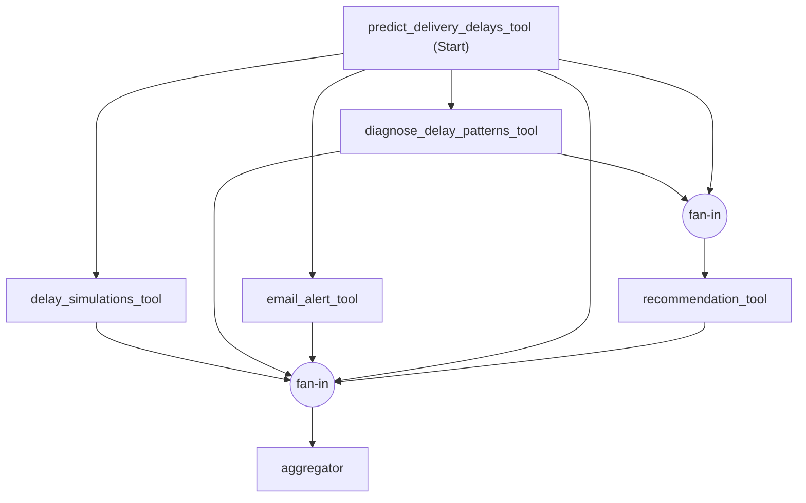

# Static-Graph DAG — condition manifest

**Who decides order and scope:** code, for everything except the security/informational
gate. Edges are **derived at runtime** from `measurement/dependencies.py`'s
`TRUE_DEPENDENCIES`, declared on MAF's own `WorkflowBuilder` (`add_fan_out_edges` for a
shared single prerequisite, `add_fan_in_edges` for a join) — not written down here or in
the topology code, so a second copy of the graph could never drift from the graph the
dependency checker judges runs against. As `TRUE_DEPENDENCIES` stands today:

| Capability | Prerequisites | Edge shape |
|---|---|---|
| predict | — | root |
| diagnose, simulate, email | predict | fan-out (concurrent) |
| recommend | predict, diagnose | fan-in (join) |

When T95 decouples simulate from predict's derived CSV, that edit lands in
`dependencies.py` and `_build_workflow()` regroups the edges automatically — no change
here. The critical path (predict -> diagnose -> recommend, 3 hops) is unaffected either
way.

Generated from the actual built `Workflow` (`scripts/export_static_graph_diagram.py`,
via the framework's own `WorkflowViz.to_mermaid()`), not hand-drawn — it can't drift
from what `_build_workflow()` executes. Fan-out (predict to diagnose/simulate/email) is
a direct edge per target; fan-in (the two joins) renders through an explicit join node,
matching `add_fan_out_edges` vs `add_fan_in_edges` semantics. Re-run the script and
replace this block if `TRUE_DEPENDENCIES` changes.

Regenerated 29-Aug-26 after the fan-in fix below — all five capabilities now feed the
final fan-in directly, not just the graph's leaves.

Note the (correct) redundancy: predict and diagnose each have both an edge into the
recommend fan-in *and* a separate edge into the aggregator fan-in — a node feeding two
downstream joins, not a duplicate or an error. That is what fixed R39 (a node
participating in more than one edge group is a supported pattern, not a special case).

Note: this is the graph `_build_workflow()` executes — the specialist tool calls and
the aggregator. It does not include `coordinator.md`'s turn-1 triage, which sits in
front of this graph and decides whether it runs at all (see above); the diagram is
scope-neutral by construction, same reasoning as excluding the triage from
`dependency_basics`/`scope_selection`.

**Turn 1 is a real, minimal model call — not structurally NULL.** `coordinator.md`
classifies the message into refuse / answer informationally / proceed, using
`security_guardrails` and `chatbot_behavior_basic` exactly as every other condition
does. It does **not** decide scope or order: an in-scope action request always runs the
full five-capability pipeline, stated as a fixed constant in code
(`_FIXED_PLAN` in `topologies/static_graph_dag.py`), not composed by the model. This
replaces an earlier design (29-Aug-26) where turn 1 was a hardcoded no-op and the graph
ran unconditionally for every message, including out-of-scope or injected text — that
gap is why the triage call was added, not a stylistic choice.

**Turn 2** runs `_build_workflow(...).run(...)` only if turn 1 set `proceed=true`; if
turn 1 refused or answered informationally, turn 2 returns that same response again,
since the harness's "Yes, proceed." has nothing left to confirm.

**Scope: an in-scope action request still runs the full graph every time.** The triage
gate does not narrow it — nothing reads the query to decide which of the five
capabilities apply. This is faithful to the pattern (a static DAG fixes all edges up
front) and is itself a measurable trade-off: on a narrow query this condition does work
the model-driven conditions skip, visible as `unprompted` tool calls and higher cost.
Compare its cost against the others only with that in mind.

**This is the control condition — deliberately, not a gap to close (decided 29-Aug-26,
confirmed on Q6).** Q6's `implied_tools_json` is `[predict, diagnose, email]`; the run
still executed all 5 capabilities, exactly as designed. The question this raised —
should DAG route to a query-scoped subgraph instead — was considered and rejected: a
router that selects which capabilities run, at runtime, from the query is not a fix to
this condition, it is Dynamic-Graph's (T87) defining property. Adding it here would
make DAG structurally indistinguishable from Dynamic-Graph on the one axis (who decides
scope, and when) the two conditions exist to contrast, and would leave T87 with nothing
distinct left to test. DAG's unconditional-full-pipeline cost stays IN the topology; it
is the number the comparison needs (the cost of zero runtime scoping), not noise to
normalize out of the topology and into the analysis layer. Report it as a finding
against the scoped conditions' cost, not as a deficiency to fix.

**Files in this folder:**
- `coordinator.md` — the turn-1 triage call described above. This is the file
  `validate_specs.py` gates per `topologies/registry.py`'s `coordinator_key`.
- `aggregator.md` — the tools-off closing pass that assembles `MasterOutput` from what
  the graph actually produced (`AggregatorNode` now passes each capability's real
  result, not just whether it ran — a 29-Aug-26 fix; the narrative fields were
  previously unfillable). It carries `self_check`/`exception_handling` since it is the
  file reporting on the completed run; `coordinator.md` does not, since the triage
  turn calls no tools (see `EXEMPT` in `validate_specs.py`).

Note: `validate_specs.py`'s per-condition checks (1-2, 2b, 4b) inspect only the file
named by `coordinator_key` — `coordinator.md`. `aggregator.md` is not walked by that
gate. Sequential has the identical gap (`sequence_planner.md` isn't walked either, only
`coordinator.md` is) — both are a structural limitation of a gate built around one file
per condition, not something specific to this topology. Flagging rather than fixing now.

**Do not hardcode edges anywhere else.** `_build_workflow()` is the entire
implementation of "dependency handling" for this condition — there is no
`dependency_discovery.md`/`dependency_basics.md` include anywhere in this folder,
because no model derives order here (see `EXEMPT` in `validate_specs.py`).

**Plan turn:** `coordinator.md` presents a real plan (the fixed 5-step list) for any
action request — `run.plan_presented` should read true for a normal run, same as every
other condition. It will read empty only if turn 1 refused or answered informationally,
same as it would for any condition whose turn 1 didn't produce an action plan.

**Expected concurrency profile:** ~1.0 exploited by construction — the graph overlaps
everything the dependency structure permits. This is the upper reference point for the
latency comparison, against Sequential's fully-serial floor (one forced tool per turn,
no overlap possible) and Planner-Executor's model-dependent batching.

**Failure handling: exceptions propagate, no retry.** `execute_topology.py` wraps no
other topology's run in a handler, so a code-level retry would give the code-scheduled
conditions resilience to transient API failures that Monolith and Planner-Executor do
not have — a difference in the measurement apparatus rather than in the topology.
Tool-level problems (`upstream_missing`, empty results) are ordinary return values and
are still handled by each specialist's own prompt.
