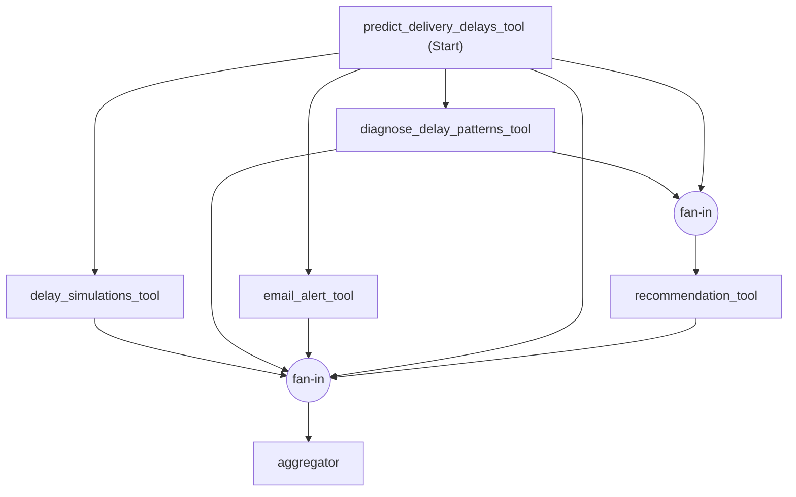

# Static-Graph Routed — condition manifest

**Who decides scope and order:** the model, in a single turn-1 call
(`coordinator.md`, `RoutedPlan`) — unlike Static-Graph DAG, where scope is fixed in
code and turn 1 only gates whether the (always-full) graph runs at all. Order, once
selected, is executed by code exactly as Static-Graph DAG's is: derived at runtime from
`measurement/dependencies.py`'s `TRUE_DEPENDENCIES` via MAF's `WorkflowBuilder`
(`add_fan_out_edges`/`add_fan_in_edges`), never written down a second time.

**Graph shape is IDENTICAL to Static-Graph DAG's, unconditionally.** `_build_workflow()`
in `topologies/static_graph_routed.py` calls the same builder methods over the same
`TRUE_DEPENDENCIES` table as `topologies/static_graph_dag.py` — every one of the five
capability nodes and the aggregator is wired into the graph regardless of what the
router selected. The diagram below is therefore graph-identical to
`static_graph_dag/README.md`'s (verified by direct comparison of the two modules'
`_build_workflow()` bodies, not re-run through `scripts/export_static_graph_diagram.py`
in this environment — no working venv here to execute it against the real built
`Workflow`; re-run that script and replace this block once a real environment is
available, per the project's evidence-over-assertion rule).

| Capability | Prerequisites | Edge shape |
|---|---|---|
| predict | — | root |
| diagnose, simulate, email | predict | fan-out (concurrent) |
| recommend | predict, diagnose | fan-in (join) |

**What the diagram does NOT show: routing.** Every node above always fires. Whether a
node does real work (an LLM call, a tool call, a `tool_call` row) or skips itself (no
call at all, sends its completion signal anyway) is decided inside `CapabilityNode`,
from the router's selected set — not a property of the graph. See the fan-in design
rationale in `topologies/static_graph_routed.py`'s module docstring for why routing
lives there and not in the graph shape (Option A, "always fire, skip internally",
confirmed 29-Aug-26 — the alternative, true exclusion via
`add_multi_selection_edge_group`, risks deadlocking the shared final fan-in, confirmed
via direct `FanInEdgeRunner` source reading, identical in pinned 1.11.0 and latest
1.16.0).

**Turn 1 is a real model call doing two jobs in one, not two turns like Sequential's.**
`coordinator.md` classifies the message into refuse / answer informationally / proceed
(`security_guardrails` + `chatbot_behavior_basic`, same as every other condition) AND,
only for an in-scope action request, selects which of the five capabilities the request
needs and the order they must run in (`scope_selection` + `dependency_basics`, reasoned
out from the capability descriptions — not handed the answer, and not closed under
`TRUE_DEPENDENCIES` in code; see the module docstring for why). This is deliberately
NOT exempt from `scope_selection`/`dependency_basics` in `validate_specs.py` — unlike
Static-Graph DAG, choosing scope and order correctly is exactly what this condition is
measured on.

**Turn 2** runs `_build_workflow(...).run(...)` only if turn 1 set `proceed=true`; if
turn 1 refused or answered informationally, turn 2 returns that same response again,
since the harness's "Yes, proceed." has nothing left to confirm.

**A missing prerequisite is a finding, not a bug this code fixes.** If the router
selects `recommend` without `diagnose`, `diagnose`'s node still fires (Option A) but
skips itself — `recommend` then runs against an empty diagnosis. This is not caught or
auto-corrected in code: it surfaces as an ordinary "missing" dependency violation in
`measurement/dependencies.py`'s `check_dependencies()`, the same mechanism and the same
finding-not-defect classification already applied to Dynamic-Graph's diagnose-skip
(Risk Log R42.1). Silently closing the selected set under `TRUE_DEPENDENCIES` would
erase the very thing under measurement here.

**Files in this folder:**
- `coordinator.md` — the turn-1 router call described above (`RoutedPlan`). This is the
  file `validate_specs.py` gates per `topologies/registry.py`'s `coordinator_key`.
- `aggregator.md` — the tools-off closing pass that assembles `MasterOutput`, told
  explicitly which capabilities the router selected so it never fabricates a summary
  for one that did not run (same ground-truth pattern as Dynamic-Graph's aggregator
  fix, Risk Log R42.4).

**Expected concurrency profile:** ~1.0 exploited among whatever subset the router
selects, same as Static-Graph DAG among all five — this condition's distinguishing
measurement is cost/scope (does it skip what a query doesn't need, the way
Dynamic-Graph does but without concurrency), not the concurrency figure itself.

**Failure handling: exceptions propagate, no retry** — same reasoning and the same
apparatus-neutrality argument as `static_graph_dag/README.md`.
